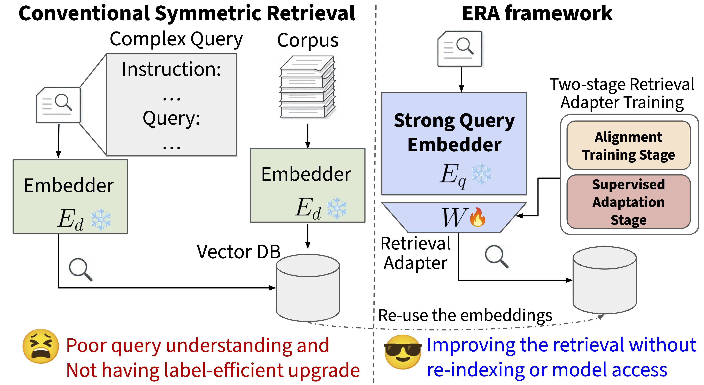

# ERA: Embedding-Retrieval Adapter

Code and pre-computed results for the paper **"[Align then Train: Efficient Retrieval Adapter Learning](https://arxiv.org/abs/2604.03403)"**.

## ⭐️ Overview

We propose an **Efficient Retrieval Adapter** framework (ERA) for retrieval that:

- **Freezes** the document-side using a lightweight encoder (Qwen3-Embedding-0.6B), so the index is computed once.
- **Adapts** the query-side with a larger encoder (Qwen3-Embedding-8B) through a lightweight linear adapter, projecting 8B representations into the 0.6B vector space.
- Trains the adapter with a **contrastive loss** on MAIR benchmark labels, optionally preceded by an **identical-text alignment** pre-training phase.

<p align="center" width="100%">
<a ></a>
</p>

## 🛠️ Setup

```bash
# Create and activate virtualenv (uv recommended)
uv venv .venv
source .venv/bin/activate

# Install dependencies
uv pip install -r requirements.txt
```

## 🔬 Running Experiments

> **Embedding cache**: The first run encodes all documents/queries and saves the embeddings to `cache/embeddings/`. Subsequent runs load from cache and skip the encoding step, making them significantly faster. Use `--force_recache` to recompute.

### Zero-shot evaluation

```bash
bash scripts/evaluate_zero_shot.sh 0,1,2,3   # multi-GPU (data parallel)
```

### Adapter training (ERA)

```bash
bash scripts/train_era_adapter.sh \
  --mode both \
  --train-ratios 0.2 \
  --output-dir results/era
```

Key options:

| Flag | Default | Description |
|------|---------|-------------|
| `--mode` | `both` | `alignment_only` / `label_only` / `both` |
| `--train-ratios` | `0.1` | Space-separated list, e.g. `"0.1 0.2 0.4"` |
| `--large-model` | `Qwen/Qwen3-Embedding-8B` | Query-side encoder |
| `--small-model` | `Qwen/Qwen3-Embedding-0.6B` | Document-side encoder |

> **Note:** `--mode label_only` corresponds to the **Embedding Adapter** baseline in the paper (label-supervised training only, without the alignment pre-training phase). This baseline is inspired by the public description from Chroma Research: [Embedding Adapters](https://www.trychroma.com/research/embedding-adapters). All source code in this repository was written independently by the authors; this repository does not include, vendor, or depend on `ChromaAdaptEmbed` code.

### Leave-One-Domain-Out (LODO)

Trains an adapter leaving out one domain at a time, then evaluates on the held-out domain to measure cross-domain generalization.

```bash
# Use only 4 GPUs
bash scripts/evaluate_lodo.sh --train-ratio 0.2 --num-workers 4
```

### Domain-specific adapter

Trains one adapter per domain using only that domain's labels, then evaluates across **all** 126 MAIR tasks to measure both within-domain gains and cross-domain transfer.

```bash
# Use only 4 GPUs
bash scripts/evaluate_domain_specific.sh --train-ratio 0.2 --num-workers 4
```

## 📂 Codebase Overview

```
.

├── requirements.txt          # Python dependencies
├── src/
│   ├── adapter/              # Adapter training modules
│   │   ├── adapted_embedder.py         # AdaptedEmbedder wrapper
│   │   ├── identical_text_alignment.py # Pre-training alignment
│   │   ├── label_training.py           # Ranking / contrastive loss training
│   │   └── era_training.py             # Orchestrates alignment + label training
│   ├── evaluation/
│   │   ├── mair_evaluator.py      # MAIR benchmark evaluator (task list, MAIR_TASKS)
│   │   ├── evaluator.py           # Generic MTEB/MAIR evaluation runner
│   │   └── embedding_cache.py     # Embedding cache manager
│   ├── models/
│   │   ├── base.py                # Abstract embedder base class
│   │   └── wrappers.py            # OpenAI, HuggingFace wrappers
│   ├── cache_config.py            # Cache directory configuration
│   └── patch_transformers.py      # Transformers patching utilities
├── scripts/
│   ├── train_era_adapter.py / .sh           # Main ERA adapter training
│   ├── pretrain_alignment.py / .sh          # Identical-text alignment pre-training
│   ├── evaluate_zero_shot.py / .sh          # Zero-shot MAIR/MTEB evaluation entry point
│   ├── evaluate_lodo.py / .sh               # Leave-One-Domain-Out evaluation
│   ├── evaluate_domain_specific.py / .sh    # Domain-specific adapter evaluation
│   └── evaluate_era_adapter.py              # Batch adapter evaluation
├── trained_weights/              # Pre-trained adapter weights shared via this repo
│   │                             # One subfolder per (query-encoder, doc-encoder) pair
│   ├── Qwen3-Embedding-8B__to__Qwen3-Embedding-0.6B/general/
│   ├── Qwen3-Embedding-8B__to__bge-m3/general/
│   ├── Qwen3-Embedding-8B__to__Qwen3-Embedding-8B/general/
│   ├── Qwen3-Embedding-8B__to__text-embedding-3-small/general/
│   ├── Qwen3-Embedding-0.6B__to__Qwen3-Embedding-0.6B/general/
│   ├── bge-m3__to__bge-m3/general/
│   ├── text-embedding-3-large__to__text-embedding-3-large/general/
│   ├── text-embedding-3-large__to__text-embedding-3-small/general/
│   └── text-embedding-3-small__to__text-embedding-3-small/general/
│       └── adapter__wd0.0001__lr0.00001__train0.4.pt  # same filename in every folder
├── results/
│   ├── no_adapter/               # Zero-shot baselines (summary.json per model)
│   └── era/          # Adapter experiments
│       └── <query>__to__<doc>/   # One dir per (query-embedder, doc-embedder) pair
│           └── with_instruction/linear/<experiment>/
│               ├── eval_results/summary.json         # Aggregated evaluation metrics
│               ├── eval_results_all_domains/summary.json  # LODO all-domain results
│               └── era_meta.json        # Training config + query splits
└── figures/                      # Output directory for generated PDF figures
```

## 🏋️ Pre-trained Weights

Pre-trained adapter weights for the general ERA adapter (trained on all 126 MAIR tasks with `--train-ratios 0.4`) are distributed with this repository for each supported model pair.

### Available weights

All weights use the filename `adapter__wd0.0001__lr0.00001__train0.4.pt`.

| Folder under `trained_weights/` | Query encoder | Document encoder | Size |
|--------------------------------|--------------|-----------------|------|
| `Qwen3-Embedding-8B__to__Qwen3-Embedding-0.6B/general/` | `Qwen/Qwen3-Embedding-8B` | `Qwen/Qwen3-Embedding-0.6B` | 17 MB |
| `Qwen3-Embedding-8B__to__bge-m3/general/` | `Qwen/Qwen3-Embedding-8B` | `BAAI/bge-m3` | 17 MB |
| `Qwen3-Embedding-8B__to__Qwen3-Embedding-8B/general/` | `Qwen/Qwen3-Embedding-8B` | `Qwen/Qwen3-Embedding-8B` | 65 MB |
| `Qwen3-Embedding-8B__to__text-embedding-3-small/general/` | `Qwen/Qwen3-Embedding-8B` | `text-embedding-3-small` | 25 MB |
| `Qwen3-Embedding-0.6B__to__Qwen3-Embedding-0.6B/general/` | `Qwen/Qwen3-Embedding-0.6B` | `Qwen/Qwen3-Embedding-0.6B` | 4.2 MB |
| `bge-m3__to__bge-m3/general/` | `BAAI/bge-m3` | `BAAI/bge-m3` | 4.2 MB |
| `text-embedding-3-large__to__text-embedding-3-large/general/` | `text-embedding-3-large` | `text-embedding-3-large` | 37 MB |
| `text-embedding-3-large__to__text-embedding-3-small/general/` | `text-embedding-3-large` | `text-embedding-3-small` | 19 MB |
| `text-embedding-3-small__to__text-embedding-3-small/general/` | `text-embedding-3-small` | `text-embedding-3-small` | 9.2 MB |

All adapters were trained on all 126 MAIR tasks with `--mode both --train-ratios 0.4`.

### Loading the adapter and encoding texts

The adapter is a lightweight linear projection (4096 → 1024). Apply it to
query embeddings produced by the large model to bring them into the small
model's vector space. Documents are encoded directly with the small model —
no adapter needed.

```python
import sys
import torch

sys.path.insert(0, ".")  # run from the ERA repo root

from src.models.wrappers import LocalHFEmbedder
from src.adapter.adapted_embedder import LinearAdapter

# ── 1. Load models ───────────────────────────────────────────────────────────
query_model = LocalHFEmbedder("Qwen/Qwen3-Embedding-8B",  use_fp16=True)   # queries
doc_model   = LocalHFEmbedder("Qwen/Qwen3-Embedding-0.6B", use_fp16=True)  # documents

# ── 2. Load adapter weights ──────────────────────────────────────────────────
ADAPTER_PATH = "trained_weights/Qwen3-Embedding-8B__to__Qwen3-Embedding-0.6B/general/adapter__wd0.0001__lr0.00001__train0.4.pt"

checkpoint = torch.load(ADAPTER_PATH, map_location="cpu")
out_dim, in_dim = checkpoint["proj.weight"].shape
adapter = LinearAdapter(in_dim, out_dim)
adapter.load_state_dict(checkpoint)
adapter.eval()
if torch.cuda.is_available():
    adapter = adapter.cuda()

# ── 3. Encode queries with large model + adapter ──────────────────────────────
instruction = "Given a user query, retrieve relevant documents."
queries = ["What is the capital of France?", "Explain transformer architecture."]

raw_query_embs = query_model.encode(
    queries,
    instruction=instruction,
    batch_size=16,
)  # shape: (N, 4096)

with torch.no_grad():
    q = torch.as_tensor(raw_query_embs, dtype=torch.float32)
    if torch.cuda.is_available():
        q = q.cuda()
    query_embs = adapter(q).cpu().numpy()  # shape: (N, 1024), L2-normalised

# ── 4. Encode documents with small model (no adapter) ────────────────────────
documents = ["Paris is the capital of France.", "Transformers use self-attention."]
doc_embs = doc_model.encode(documents, batch_size=256)  # shape: (M, 1024)

# ── 5. Compute similarity ─────────────────────────────────────────────────────
scores = query_embs @ doc_embs.T  # cosine similarity (both sides are L2-normalised)
print(scores)
```

> **Note:** The `instruction` string should match the task-specific instruction used during training. MAIR task instructions are accessible via `src.evaluation.mair_evaluator.MAIRDataset`.

## 💿 Used Benchmark Dataset

| ID  | OSS Component Name | Modified | Copyright Holder | Upstream Link | License  |
|-----|----------------------------------|----------|------------------|-----------------------------------------------------------------------------------------------------------|--------------------|
| 1 | MAIR | No | Carnegie Mellon University, Shandong University, Soochow University, Baidu Inc., Leiden University | [link](https://huggingface.co/MAIR-Bench) | [Apache-2.0](https://www.apache.org/licenses/LICENSE-2.0) |

## 📚 Citation

```
@article{maekawa2026align,
  title={Align then Train: Efficient Retrieval Adapter Learning},
  author={Maekawa, Seiji and Aminnaseri, Moin and Pezeshkpour, Pouya and Hruschka, Estevam},
  url={https://arxiv.org/abs/2604.03403},
  year={2026}
}
```

## 📜 Disclosure
Embedded in, or bundled with, this product are open source software (OSS) components, datasets and other third party components identified below. The license terms respectively governing the datasets and third-party components continue to govern those portions, and you agree to those license terms, which, when applicable, specifically limit any distribution. You may receive a copy of, distribute and/or modify any open source code for the OSS component under the terms of their respective licenses, which may be BSD 3 clause license and Apache 2.0 license. In the event of conflicts between Megagon Labs, Inc., license conditions and the Open Source Software license conditions, the Open Source Software conditions shall prevail with respect to the Open Source Software portions of the software. 
You agree not to, and are not permitted to, distribute actual datasets used with the OSS components listed below. You agree and are limited to distribute only links to datasets from known sources by listing them in the datasets overview table below. You are permitted to distribute derived datasets of data sets from known sources by including links to original dataset source in the datasets overview table below. You agree that any right to modify datasets originating from parties other than Megagon Labs, Inc. are governed by the respective third party’s license conditions. 
All OSS components and datasets are distributed WITHOUT ANY WARRANTY, without even implied warranty such as for MERCHANTABILITY or FITNESS FOR A PARTICULAR PURPOSE, and without any liability to or claim against any Megagon Labs, Inc. entity other than as explicitly documented in this README document. You agree to cease using any part of the provided materials if you do not agree with the terms or the lack of any warranty herein.
While Megagon Labs, Inc., makes commercially reasonable efforts to ensure that citations in this document are complete and accurate, errors may occur. If you see any error or omission, please help us improve this document by sending information to contact_oss@megagon.ai.